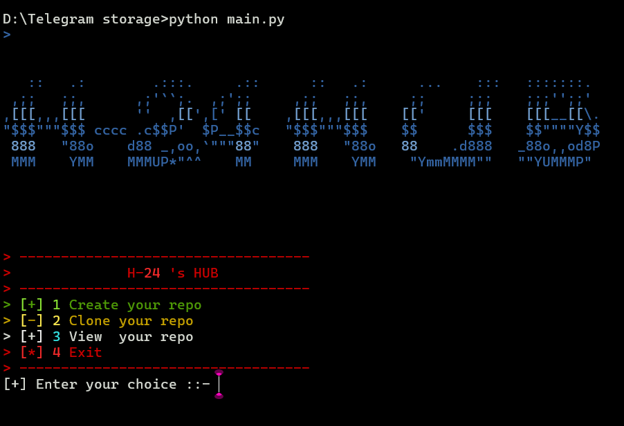
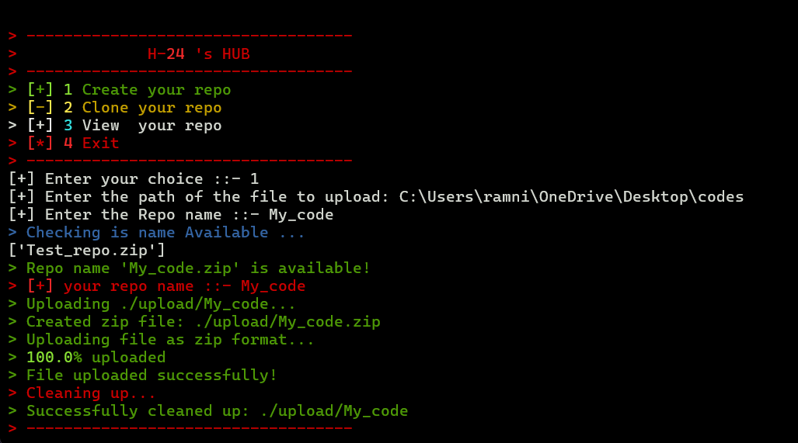
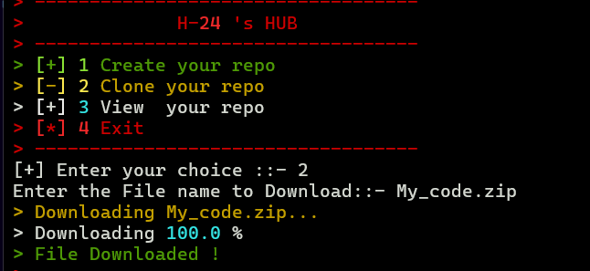
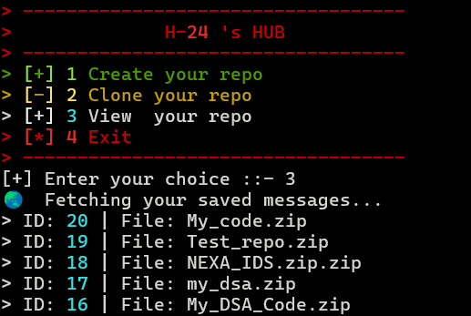

# 🚀 H-24 Hub - Telegram Cloud Storage

**H-24 Hub** is an innovative personal cloud storage solution that cleverly utilizes your Telegram "Saved Messages" as a free and unlimited cloud storage platform. By leveraging ZIP compression, it transforms Telegram's file size limitations into a workaround for unlimited storage!

## 💡 The Idea

Telegram's free users have a **2GB file limit per file**, and premium users have a **4GB limit**. H-24 Hub solves this limitation by:
- **Compressing folders into ZIP archives** before uploading
- **Splitting large repositories** into manageable chunks
- **Managing storage efficiently** without paying for cloud services
- **Keeping your data private** using Telegram's secure infrastructure

This way, you can store **unlimited data** on Telegram without worrying about file size restrictions!

---

## 📋 Table of Contents
- [Features](#features)
- [Prerequisites](#prerequisites)
- [Installation](#installation)
- [How to Use](#how-to-use)
- [Use Cases with Screenshots](#use-cases-with-screenshots)
- [Security](#security)
- [Future Features](#future-features)

---

## ✨ Features

✅ **ZIP Compression** - Automatic ZIP compression for efficient storage <br> 
✅ **Progress Tracking** - Real-time upload/download progress bars using Rich library <br>
✅ **Repo Management** - Create, clone, and view your stored repositories <br>
✅ **Security First** - Sensitive keys protected via .env and .gitignore <br>
✅ **Async Operations** - Fast asynchronous file handling with Pyrogram <br>
✅ **Beautiful UI** - Colorful terminal interface with custom styling <br>
✅ **Easy Setup** - Simple configuration with Telegram API credentials<br>

---

## 📚 Prerequisites

- **Python 3.10** or higher installed
- **A Telegram account** (free or premium)
- **Git** (for cloning the repository)
- **pip** (Python package manager)

---

## 🔧 Installation

### Step 1: Obtain Telegram API Credentials

1. Go to [my.telegram.org](https://my.telegram.org)
2. Log in with your phone number
3. Click on **"API development tools"**
4. Create a new application (give it any name like "H-24 Hub")
5. Copy your `api_id` and `api_hash`

### Step 2: Clone the Repository

```bash
git clone https://github.com/prajapatiHardik2008/H-24_Hub.git
cd H-24_Hub
```

### Step 3: Install Dependencies

```bash
pip install pyrogram TgCrypto-pyfork rich python-dotenv
```

### Step 4: Setup Configuration

Create a `.env` file in the root folder and add your credentials:

```env
API_ID=your_api_id_here
API_HASH=your_api_hash_here
```

**⚠️ Important:** Never share your `.env` file or commit it to GitHub!

---

## 🎯 How to Use

### Menu Interface

When you run the application, you'll see this beautiful menu:



```
-----------------------------------
             H-24's HUB           
-----------------------------------
[+] 1 Create your repo
[-] 2 Clone your repo
[+] 3 View your repo
[*] 4 Exit
-----------------------------------
```

**Run the application:**
```bash
python main.py
```

---

## 📸 Use Cases with Screenshots

### 📤 Use Case 1: Create Your Repo (Upload)

**What it does:** Compresses and stores a local folder to your Telegram Saved Messages

**Steps:**
1. Select option `1` from the main menu
2. Enter the path of the folder you want to upload (e.g., `./my_project`)
3. Enter a repo name (e.g., `my_backup`)
4. The system will:
   - Create a copy of your folder
   - Compress it into a ZIP file (saves space!)
   - Upload it to your Telegram Saved Messages
   - Clean up temporary files automatically



**Real-world Example:**
```
[+] Enter the path of the file to upload: ./my_python_project
[+] Enter the Repo name ::- my_python_project
[+] your repo name ::- my_python_project
> Creating zip file: ./upload/my_python_project.zip
> Uploading ./upload/my_python_project...
> 25.5% uploaded
> 50.0% uploaded
> 75.5% uploaded
> 100.0% uploaded
> File uploaded successfully!
> Successfully cleaned up: ./upload/my_python_project
```

---

### 📥 Use Case 2: Clone Your Repo (Download)

**What it does:** Fetches and extracts your stored repositories from Telegram

**Steps:**
1. Select option `2` from the main menu
2. Enter the exact file name you want to download (e.g., `my_python_project.zip`)
3. The system will:
   - Search your Telegram Saved Messages
   - Download the ZIP file with real-time progress
   - Extract it to the `Downloads` folder
   - Show completion message



**Real-world Example:**
```
Enter the File name to Download::- my_python_project.zip
> Downloading my_python_project.zip...
> Downloading 15.3% 
> Downloading 45.8% 
> Downloading 75.2% 
> Downloading 100.0% 
> File Downloaded !
```

---

### 👁️ Use Case 3: View Your Repo

**What it does:** Lists all your saved files and messages in Telegram

**Steps:**
1. Select option `3` from the main menu
2. The system displays:
   - All document files with their message IDs
   - Recent text messages
   - File names and details
   - Total count of saved items



**Real-world Example:**
```
> Fetching your saved messages...
ID: 12345 | File: my_python_project.zip
ID: 12346 | File: documentation.pdf
ID: 12347 | File: backup_2024.zip
ID: 12348 | Text: Important notes about project...
```

---

### 💾 Use Case 4: Multi-Backup Strategy

**Scenario:** You have multiple projects and want organized backups

```
Upload 1: my_python_project.zip (2.5 GB)
Upload 2: my_react_app.zip (1.8 GB)
Upload 3: database_backup.zip (3.2 GB)
Upload 4: documents_archive.zip (1.5 GB)

Total Storage Used: 9 GB on Telegram (FREE!)
Cost Saved: ~$10-20/month vs traditional cloud storage
```

---

## 🔒 Security

⚠️ **IMPORTANT:**
- **Never share** your `*.session` files or `.env` file
- **Always ensure** your `.gitignore` includes:
  - `*.session` - Contains your Telegram session
  - `*.session-journal` - Session backup file
  - `.env` - API credentials
  - `__pycache__/` - Python cache
  - `Downloads/` - Downloaded files

**Your `.gitignore` is already configured!**

---

## 🚀 Future Features & Ideas

### 🎯 Phase 1: Enhanced Core Features ⭐ Priority
- [ ] **File Encryption** - Add AES-256 encryption before uploading
- [X] **Selective File Upload** - Upload specific files instead of entire folders
- [ ] **Auto-Compression Settings** - Choose compression level (fast/balanced/maximum)
- [ ] **Scheduled Backups** - Automatic daily/weekly backups
- [ ] **Backup History** - Version tracking with timestamps

### 🎯 Phase 2: Advanced Storage Management
- [X] **File Search & Filter** - Search by name, date, or size in Telegram
- [ ] **Differential Backup** - Only backup changed files (like Git)
- [ ] **Deduplication** - Detect and skip duplicate files
- [ ] **Storage Analytics** - Show used space and storage breakdown
- [ ] **Multi-Account Support** - Use multiple Telegram accounts for more storage

### 🎯 Phase 3: Collaboration & Sharing
- [ ] **Share Links** - Generate shareable links for specific repos
- [ ] **Team Storage** - Collaborate with multiple users
- [ ] **Access Control** - Set permissions (read-only, read-write)
- [ ] **Sync Folder** - Keep local folder synced with cloud (like Google Drive)
- [ ] **Conflict Resolution** - Handle file conflicts during sync

### 🎯 Phase 4: Advanced Features
- [ ] **Split Large Files** - Automatically split files > 4GB
- [ ] **Incremental Sync** - Only sync changed files
- [ ] **Database Backup** - Built-in backup for databases
- [ ] **Media Organization** - Smart album creation for media files
- [ ] **API & CLI Tools** - Command-line interface for automation
- [ ] **Docker Support** - Run in containers for easy deployment

### 🎯 Phase 5: UI & UX Improvements
- [ ] **Web Dashboard** - Beautiful web interface
- [ ] **Mobile App** - iOS/Android companion app
- [ ] **Notifications** - Push notifications for upload/download completion
- [ ] **Dark Mode** - Theme customization
- [ ] **Multi-Language** - Support for multiple languages

### 🎯 Phase 6: Performance & Optimization
- [ ] **Parallel Downloads** - Download multiple files simultaneously
- [ ] **Resume Downloads** - Continue interrupted downloads
- [ ] **Smart Caching** - Cache frequently accessed files
- [ ] **Bandwidth Limiting** - Control upload/download speed
- [ ] **Memory Optimization** - Handle large files efficiently

---

## 📊 Storage Calculation & Benefits

### How Much Can You Store?

| User Type | File Limit | ZIP Compression | Effective Storage |
|-----------|-----------|-----------------|-------------------|
| Free User | 2 GB | 50% | **4 GB per upload** |
| Premium User | 4 GB | 50% | **8 GB per upload** |
| 10 Repos (Free) | - | - | **40 GB total** |
| 10 Repos (Premium) | - | - | **80 GB total** |

### Cost Comparison

| Service | Monthly Cost | Storage |
|---------|-------------|---------|
| Google Drive | $1.99 | 100 GB |
| Google Drive | $9.99 | 2 TB |
| Dropbox | $9.99 | 2 TB |
| iCloud | $9.99 | 2 TB |
| **H-24 Hub** | **$0** | **Unlimited!** |

**💰 You save $9.99/month × 12 = $119.88/year! 🎉**

---

## ⚡ Quick Start

```bash
# 1. Clone the repository
git clone https://github.com/prajapatiHardik2008/H-24_Hub.git
cd H-24_Hub

# 2. Install dependencies
pip install -r requirements.txt

# 3. Create .env file with your Telegram API credentials
echo "API_ID=your_api_id" > .env
echo "API_HASH=your_api_hash" >> .env

# 4. Run the application
python main.py

# 5. Choose option 1 to upload your first repo!
```

---

## 🎓 Technologies Used

- **Pyrogram** - Telegram Client Library
- **TgCrypto** - Cryptography for Telegram
- **Rich** - Beautiful terminal UI
- **Python asyncio** - Asynchronous programming
- **Zipfile** - File compression
- **Python-dotenv** - Environment variable management

---

## 📁 Project Structure

```
H-24_Hub/
├── main.py                  # Main application entry point
├── upload_file.py           # Handles file uploads to Telegram
├── download_file.py         # Handles file downloads from Telegram
├── saved_files.py           # Lists saved messages
├── ui_handler.py            # Beautiful terminal UI
├── auto_push.py             # Git automation (optional)
├── .env                     # Your API credentials (SECRET!)
├── .gitignore              # Ignore sensitive files
├── requirements.txt        # Python dependencies
├── README.md               # This file
└── assets/                 # Screenshots and images
    ├── front.png           # Main interface screenshot
    ├── create_repo.png     # Create repo example
    ├── clone_repo.png      # Clone repo example
    └── view_repo.png       # View repo example
```

---

## 🤝 Contributing

Contributions are welcome! Feel free to:
- 🐛 Report bugs
- 💡 Suggest features
- 🔧 Submit pull requests
- 📝 Improve documentation

---

## 📄 License

This project is open source and available for educational purposes.

---

---


---

## 📞 Support & Troubleshooting

If you face issues:
1. ✅ Check that your API credentials are correct in `.env`
2. ✅ Ensure Python 3.10+ is installed: `python --version`
3. ✅ Verify all dependencies: `pip list | grep pyrogram`
4. ✅ Check your internet connection
5. ✅ Open an issue on GitHub with error details

---

## 🎯 Project Stats

- **Language:** Python 3.10+
- **Lines of Code:** ~500+
- **Features Implemented:** 4 Core Features
- **Features Planned:** 20+ New Features
- **Dependencies:** 4 (Lightweight!)
- **Storage Capacity:** Unlimited (via Telegram)
- **Cost:** $0 (Completely Free!)
- **Complexity Level:** Intermediate to Advanced
- **Development Time:** Perfect for FY Project! ⭐

---

## 🌟 Key Achievements

✨ Created a unique cloud storage solution using Telegram
✨ Implemented async file operations for better performance
✨ Built beautiful terminal UI with Rich library
✨ Solved the 2GB/4GB file size limitation problem
✨ Demonstrated full-stack Python development skills

---

**Made with ❤️ by H-24**

*Transform Telegram into your personal cloud storage! Store unlimited data for absolutely FREE! 🚀*

---

**Last Updated:** 2024
**Version:** 1.0.0
**Status:** ✨ Active Development - Ready for Production Use!
